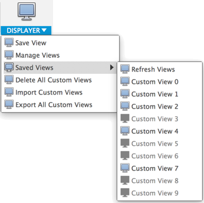
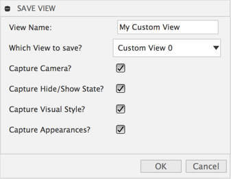

# Fusion360 Displayer
Set of Utilities for custom display and views in Fusion 360

The documentation still needs much work but here is a rough outline

_Note: there are a bunch of things I still have planned for this_

## Commands:

### Save View

Saves the current view.

Give it a name and choose which custom view slot to save it into.
Use Unique names to avoid issues.

You can select to save:
* Camera Orientation
* Hide / Show state of all parts
* Visual Style (Shaded, Wire Frame, etc.)
* Applied Appearances

_Note: exporting appearances is not supported_

### Manage Views
Allows you to reassign custom views and individually delete them

Removes all appearance overrides in the model

### Saved Views

Displays all the views that you have saved in this model.
When you switch between different documents you have to manually hit the refresh views button to get the list to update.

_Note: the tooltip on the command will match the name of the view you saved.

### Delete All Custom Views

Deletes all the views that you have saved in this model.

### Import Custom Views

Imports view definitions that you previously saved.
This is particularly useful when working with multiple copies of the same model and you want to jump to the exact same view.
Note if you have custom views defined in the current model and you import a view file with the same view numbers defined it will overwrite the one in your current model.

### Export all Custom Views

Exports all the views that you have saved in this model.

_Note: exporting appearances is not supported_

## Custom keyboard shortcuts

A useful way to use this add-in is to map the 10 custom view commands to keyboard shortcuts.
Something like cmd+0, cmd+1, cmd+2, etc. could be very useful.

To do this you need to set it up 1 time.  Then it will be valid every model when you have the add-in running.

1. Save a view into each of the custom view slots so they are all active
2. select the small menu icon to the right of the command
3. Pick: *Change Keyboard Shortcut...*
4. Setup the keyboard shortcut for each of the 1 custom views

I realize this is tedious, but it only has to be done once.

## Setup
Download or clone this repo.

Move the folder into your add-ins directory.  [Click Here](https://tapnair.github.io/installation.html) for more information

Files in the Fusion360Utilities folder should not be modified.

Rename the following items to your desired addin name:
* The top level folder
* Fusion360AddinSkeleton.py
* Fusion360AddinSkeleton.manifest

Edit the manifest file and update the fields accordingly

## License
Samples are licensed under the terms of the [MIT License](http://opensource.org/licenses/MIT). Please see the [LICENSE](LICENSE) file for full details.

## Written by

Written by [Patrick Rainsberry](https://twitter.com/prrainsberry)   (Autodesk Fusion 360 Business Development)

See more useful [Fusion 360 Utilities](https://tapnair.github.io/index.html)

